# Public Beta MVP Completion Sprint - 2026-07-11

> Document Role: Non-authoritative execution plan
> Status: Active
> Owner: VHC Core Engineering + VHC Launch Ops
> Human authority: Lou
> Technical orchestrator: Codex
> Last Reviewed: 2026-07-11
> Depends On: `docs/foundational/trinity_project_brief.md`, `docs/foundational/TRINITY_Season0_SoT.md`, `docs/foundational/System_Architecture.md`, `docs/foundational/STATUS.md`, `docs/ops/public-beta-operational-state.md`, `docs/ops/public-beta-launch-readiness-closeout.md`

## Purpose And Precedence

This sprint is the shortest evidence-honest route from the current public-feed
incident to a working Venn News Web PWA and then to a controlled public beta.
It organizes outcomes, dependencies, owners, reviews, and completion evidence.
It does not redefine product behavior, architecture, live state, or operator
authority.

When anything in this sprint conflicts with a canonical owner, follow the
precedence in `docs/README.md`:

1. product intent and Season 0 scope;
2. normative behavior and data specs;
3. architecture;
4. implementation status;
5. operational state and runbooks;
6. this sprint and its executable companion checklist.

Moving evidence and the active decision live only in
`docs/ops/public-beta-operational-state.md`. Exact relay and publisher commands
live in their runbooks and reviewed packets. The 24 release gates and allowed
claims live in `docs/ops/public-beta-launch-readiness-closeout.md`.

## Sprint Outcome

Deliver three progressively stronger outcomes:

1. **Recovered foundation:** the public publisher and all three relays are
   sustained-green through the exact S1 T0+48h gate.
2. **Working MVP:** a real user can complete the news, synthesis, stance, and
   discussion loop on the deployed PWA, and independent browsers prove
   persistence, convergence, and privacy.
3. **Controlled public beta:** Lou records a final GO against complete evidence
   and at most 100 US/Canada testers enter a monitored, reversible first tranche.

The sprint is gate-driven. Its irreducible critical-path floor includes 48
elapsed hours after a valid publisher T0. Coding speed, a clean immediate
readback, or human approval cannot compress that evidence window.

## Activation Snapshot

At the 2026-07-11 planning boundary, the operational owner records G0-G3 repo
work complete, the first supervised G4 attempt closed before mutation, S1 red,
publisher T0 absent, and S2+ blocked. The structural next gate is a newly
reviewed private-staging envelope and binding. A reproducible one-second
finalization deadline defect also remains a pre-release repo blocker.

Do not copy the exact revision, decision, tuple hashes, mailbox count, or next
attempt state into this sprint. Read them from
`docs/ops/public-beta-operational-state.md` before every gate; newer evidence
overrides this dated planning basis.

## What Counts As A Working MVP

The working MVP proves this vertical civic-information loop:

```text
discover -> understand -> take point-level stance -> persist -> converge -> discuss
```

| User journey | Required observable result |
| --- | --- |
| Open the product | The public PWA loads without a fixture-only claim and presents a usable, preference-aware news feed. |
| Discover current news | Singleton and corroborated stories propagate from current RSS input, preserve stable story identity, paginate, refresh, and restore coherently. |
| Understand a story | Story detail shows source evidence plus an accepted-current `TopicSynthesisV2` summary, facts, frame/reframe rows, provenance, warnings, and honest pending/unavailable/corrected states. |
| Sign in and return | Apple and Google provide account continuity through the deployed callback boundary; X is hidden. Sign-in does not claim verified-human status. |
| Establish beta identity | Account state binds to beta-local LUMA compartments and signed-write policy without claiming Silver, uniqueness, Sybil resistance, or residency. |
| Express stance | Agree/Neutral/Disagree targets stable frame/reframe point IDs keyed by `(topic_id, synthesis_id, epoch, point_id)`, never a generic story like/dislike. |
| See persistence and convergence | One final stance survives reload and aggregate-only results converge on independent non-voting browsers without treating local echo as proof. |
| Lose the mesh temporarily | Local stance intent remains visibly pending, never fakes aggregate success, retries on reconnect, and reaches a bounded honest failure if persistence cannot complete. |
| Use it accessibly | Feed, detail, stance, and discussion remain keyboard-operable with visible focus, distinct labels/pressed state, screen-reader meaning, and reduced-motion-safe behavior. |
| Discuss and correct | One deterministic HERMES thread persists per story; reporting, correction, and audited trusted-operator moderation remain available. |
| Remain private | Public paths, payloads, logs, telemetry, and evidence expose no OAuth token, provider subject, private key, raw proof, nullifier, address, wallet, district linkage, private profile, or local vote intent. |
| Get help safely | Policy, support, and data-deletion routes are reachable; public support never asks for secrets and private escalation has a named owner. |

The **working MVP threshold** is reached only after M5 below. Repository
capability, a green relay `/readyz`, a cached feed, a single clean tick, a local
fixture demo, or S1 recovery alone is not a working-product claim.

## Foundational Vision Boundary

This sprint narrows the release surface; it does not narrow TRINITY's vision.
The local-first LUMA + VENN/HERMES + GWC architecture remains intact.

The controlled beta proves the news-first core of the Civic Dignity Loop. The
following remain architecturally preserved but are not launch blockers:

- the full five-kind unified feed;
- linked-social ingestion;
- Reply-to-Article collaborative publishing;
- nomination, elevation artifacts, and representative forwarding;
- familiar-assisted workflows;
- XP/Daily Boost and public GWC economic UX.

Explicit non-goals for this sprint are production-attestation/LUMA Silver,
verified-human or one-human-one-vote claims, public WSS mesh `release_ready`,
independent host-failure tolerance, native App Store/TestFlight packaging, full
RBAC/case management, a private support SLA, relay retention/compaction work,
and autonomous production execution. Canonical pager deployment is outside the
working-MVP threshold but remains a controlled-public-beta gate in M6.

## Critical Path

```mermaid
flowchart LR
  M0["M0: Freeze and rebind"] --> M1["M1: S1 recovery plus 48h"]
  M1 --> M2["M2: StoryCluster release-ready"]
  M2 --> M3["M3: Auth and provider preflight"]
  M3 --> M4["M4: Release deploy and live canaries"]
  M4 --> M5["M5: Evidence and user rehearsal"]
  M5 --> W["Working MVP"]
  W --> M6["M6: First 100 testers"]
  M6 --> M7["M7: Observe, hold, or expand"]
```



| Milestone | Existing gates | Outcome | Minimum next eligibility |
| --- | --- | --- | --- |
| M0 | G4-PREP / G4-REVIEW-BIND; G0-G3 historical complete | Frozen recovery revision, private staging envelope, review, new binding | Exact attempt 002 authority |
| M1 | S1/S1A/S1B, G4 | Relay A/B/C, publisher recovery, evidence producers, T0+24h and passing T0+48h | S2 unblocked |
| M2 | S2 | StoryCluster credentials, sources, correctness, and production readiness green | S3 eligible |
| M3 | S3, S4a, S5a | Auth boundary deployed; Apple/Google registered and start-leg healthy | Release PWA build eligible |
| M4 | S6, S7, S4b, S5b, S8 | Release commit deployed; full provider return legs and accepted synthesis pass | Evidence regeneration eligible |
| M5 | S9, S10 | Fresh release packet and multi-browser product proof pass | Working MVP |
| M6 | S11 | Control record and distribution packet complete; Lou GO; first tranche | Controlled beta live |
| M7 | S12 | First-tranche evidence and explicit hold/expand decisions | Later tranche eligibility |

## Revision And Evidence Strategy

Durable guards:

- `FINAL_MAIN_REVISION_BINDS_RELAY_IMAGE_AND_PUBLISHER_CHECKOUT`
- `IMMEDIATE_RECOVERY_IS_NOT_S1_GREEN`
- `T0_PLUS_24H_IS_INTERMEDIATE_ONLY`
- `T0_PLUS_48H_REQUIRED_TO_UNBLOCK_S2`

### Freeze A - S1 Recovery Revision

Keep `origin/main` at the reviewed S1 revision until passing T0+48h closure.
Any merge changes `main` and invalidates the current revision-bound recovery
envelope unless the image, packet, review, and binding are regenerated.

During Freeze A:

- PRs may be prepared and reviewed in isolated branches;
- no pending PR, including #770 or the finalization timing fix, merges to main;
- no later release commit is deployed to A6;
- attempt-specific artifacts remain private and immutable.

### Freeze B - Product Release Commit R

After S1 closes, merge all approved repository work needed for the product,
controls, docs, auth/PWA build, and transition-aware GO guards. Then designate
one product release commit **R**.

Build, deploy, canary, release evidence, and user rehearsal bind to R. Any
runtime, product, build, configuration-contract, or gate change after R creates
a new R and requires affected evidence to be regenerated.

### Control-Record Commit C

A tracked packet cannot contain its own not-yet-created Git SHA. Final GO
therefore uses a second commit:

- **R:** deployed product commit and the subject of product/live evidence;
- **C:** later control-record-only commit recording Lou's decision and
  completed launch/distribution fields against R.

C is identified by the Git commit that introduces the record; it must not claim
to recursively embed its own hash. Transition-aware guards must already be
merged before R; C may change only approved control records. Any guard,
product, or runtime change in C invalidates the model and requires a new R.
The tracked record stores literal `this_record_commit`; hosted binding evidence
resolves that sentinel to the actual Git HEAD SHA for C.

## Operating And Review Model

Each repo lane uses an isolated branch/worktree and independent reviewer; each
live lane uses one explicitly authorized driver and a separate evidence
reviewer. Record `GO`, `NO-GO`, `WAITING_FOR_LOU`, or `BLOCKED_EXTERNAL` without
collapsing prepared, reviewed, authorized, executed, or elapsed-green states.

## Lane And Evidence Matrix

| Lane | Driver | Independent acceptance | Required durable output | Live authority |
| --- | --- | --- | --- | --- |
| `G4-PREP` | Packet-preparation agent | Same packet reviewer after every correction | New private-staging envelope, index, validation, and attempt ID | None |
| `G4-REVIEW-BIND` | Orchestrator | Packet reviewer GO, then exact Lou confirmation | Review ledger plus new execution binding | Lou confirmation only |
| `G4-LOAD` | One technical driver | Load-evidence reviewer | Transfer/checksum/load/immutable-image evidence | Exact staging/load authority |
| `G4-RELAY-A` | Same technical driver | Relay evidence reviewer | Private A evidence with next-relay decision | Exact A authority |
| `G4-RELAY-B` | Same technical driver | Same relay reviewer | Private B evidence with next-relay decision | Exact B authority after A GO |
| `G4-RELAY-C` | Same technical driver | Same reviewer plus distinct aggregate reviewer | `vh-a6-s1b-relay-recovery-evidence-v1` | Exact relay C authority after relay B GO |
| `G4-PUBLISHER` | One technical driver | Publisher-evidence reviewer | Preflight, start-control, readback, alerts, mailbox, finalization | Separate Lou publisher authority |
| `G4-EVIDENCE-PRODUCERS` | One technical driver | Watch/evidence reviewer | Fresh producer-state and first-sample inventory | Separate authority for any enablement |
| `G4-SOAK` | Watch operator | Closure reviewer | Immediate, T0+24h, and passing T0+48h packets | Read-only collection unless incident authority is granted |
| `G5-CONTROL-FIXES` | Focused repo agents | Lane reviewers plus cross-lane review | Finalization fix and transition-aware blocked/GO guards | None; no Freeze-A merge |
| `G5-STORYCLUSTER` | StoryCluster operator/agent | StoryCluster reviewer | `.tmp/storycluster-production-readiness/latest/production-readiness-report.json` | Lou secret/A6 window |
| `G5-AUTH` | Auth deployment driver | Auth/security reviewer | Secret-safe boundary health and durable-store evidence | Lou Cloudflare login/MFA |
| `G6-APPLE` | Provider driver | Provider/security reviewer | Apple configured-health and start-leg preflight | Lou Apple account/MFA |
| `G6-GOOGLE` | Provider driver | Provider/security reviewer | Google configured-health and start-leg preflight | Lou Google account/MFA |
| `G7-PWA-A6` | Release driver | Deployment reviewer | R/image/component matrix and public readback | Separate A6 deploy authority |
| `G7-PROVIDER-REHEARSAL` | Session driver | Privacy/account reviewer | `auth-callback-provider-rehearsal-v1` bound to R | Lou provider sessions |
| `G7-CANARY` | Canary driver | Analysis/readback reviewer | Public synthesis catch-up summary bound to R | Separate canary authority |
| `G8-EVIDENCE` | Evidence owner | Cross-lane release reviewer | Release pipeline, all 24 gates, closeout, CI | Read-only/live probes already authorized by packets |
| `G8-REHEARSAL` | Session operator | Independent browser/privacy reviewer | Deployed three-browser evidence plus production-shaped local five-user evidence | Lou attended deployed-session authority; local lane has none |
| `G8-CONTROL-RECORD` | Release-record owner | Docs/control reviewer | Control-record-only C binding final decision to R | Lou release decision |
| `G8-PAGER` | Pager deployment driver | Incident-response/security reviewer | Signed alert, durable issue, subscription, push/email receipt, acknowledgement, heartbeat, and external dead-man evidence | Separate Lou pager deployment/test-fire authority |
| `G8-DISTRIBUTION` | Distribution owner | Launch reviewer | Completed distribution packet and first-tranche ledger | Lou tester-wave authority |
| `G9-WATCH` | Watch operator | Release/incident reviewer | Per-tranche 24-hour packet and hold/rollback/expand decision | Separate Lou decision per expansion |

## M0 - Protect, Prepare, Review, Bind

### Objective

Make one safe attempt 002 possible without changing the reviewed recovery
revision or erasing attempt 001.

### Work

1. Preserve attempt 001 and its evidence index byte-for-byte.
2. Select a current-user-owned, non-symlink, non-shared, mode-`0700` staging
   root. Never reuse, clean, or chmod `/tmp/vhc-public-beta-images`.
3. Refresh the moving mailbox and all read-only A6 prestate.
4. Regenerate every load/supervision artifact and index affected by the new
   staging path.
5. Require independent subsequent review of the exact regenerated envelope.
6. Obtain a new exact Lou binding for the reviewed tuple and attempt ID.
7. Separately classify the PR #770 finalization failure. Prepare a permanent
   fix so a positive wait budget guarantees at least one finalization attempt,
   but do not merge it during Freeze A.

### GO

- the private staging path and permissions pass all preconditions;
- exact hashes and artifact relationships are internally consistent;
- reviewer P0/P1/P2 counts are zero;
- Lou's confirmation matches the reviewed bytes exactly;
- no newer or unbound critical, tuple drift, user job, or secret-bearing output
  exists.

Any exit `78` closes the attempt. Do not retry, hand patch, chmod, clean, or
select an alternate path outside a fresh review/binding cycle.

## M1 - Complete S1 And Earn The 48-Hour Gate

### G4-LOAD

Authority covers only staging, transfer, checksum verification, `docker load`,
and immutable image verification. It does not authorize relay replacement.

GO requires exact image ID, OCI revision, `linux/amd64`, reviewed topology, and
unchanged publisher-parked/read-only prestate.

### G4-RELAY-A/B/C

Run strictly:

```text
A -> independent evidence acceptance
B -> independent evidence acceptance
relay C -> independent evidence plus aggregate acceptance
```

The publisher stays parked. Each relay must prove immutable image, environment,
mounts, host-network intent, snapshots, health, readiness, OOM/watchdog state,
empty user-job boundary, and exact signed readback for story, latest-index,
hot-index, and synthesis-lifecycle routes.

A rollback recreates only the current relay from its captured old image and
stops. A rollback leaves S1 red and requires a fresh tuple.

### G4-PUBLISHER

Accepted relay-C evidence does not grant publisher authority. Lou separately binds
and executes the complete controller sequence owned only by
`docs/ops/news-aggregator-production-service.md`, including installation,
park/preflight/start/verify, evidence-producer proof, atomic T0 update, and
finalization. Do not copy or abbreviate that command sequence here.

Immediate readback requires two clean completed ticks, successful raw writes,
all four signed routes across all three relays, advancing product indexes and
snapshots, stable active/running service state, and one readable recovery
transition.

### G4-EVIDENCE-PRODUCERS

Before accepting T0, prove fresh output from publisher liveness, relay
liveness, relay snapshot, public-feed freshness, alert watch, hourly soak
archive, and watch-closure producers.

This is a separate authority boundary. Enabling relay liveness can restart one
eligible relay, so monitor enablement may not be smuggled into publisher
authority. If any producer is disabled or misconfigured, stop for an exact
reviewed authority packet. If producer coverage cannot include the immediate
readback timestamp, atomically reset T0; never backfill a window.

### G4-SOAK

- Immediate recovery starts the window; it does not green S1.
- T0+24h is required intermediate evidence only.
- T0+48h must pass with no archive gaps, publisher restart increase, failed
  tick/write, stale feed/snapshot, relay failure, watchdog/OOM, unsafe memory
  projection, duplicate unchanged incident delivery, unresolved public-feed
  critical, or moving-mailbox critical.

Only a passing T0+48h closure and cleared mailbox make S2 eligible.

## M2 - Make StoryCluster Release-Ready

### Preconditions

- S1A/S1B have passing T0+48h closure;
- the moving mailbox has no unresolved public-feed critical;
- Lou provides the secret-bearing access window.

### Work And Evidence

1. Repair the credential/endpoint only in the correct private secret store.
2. Never print or persist credentials or provider error bodies.
3. Restart only the StoryCluster surface if its effective environment changed;
   this lane does not authorize publisher restart.
4. Run:

```bash
corepack pnpm@9.7.1 collect:storycluster:headline-soak
corepack pnpm@9.7.1 check:storycluster:production-readiness
```

5. If access repair reveals a real source, clustering, correctness, or evidence
   defect, create a focused implementation lane and continue until the fresh
   production-readiness report is `release_ready`.

Changing the failure class from credentials to a product blocker does not make
M2 green.

## M3 - Deploy Auth And Prepare Providers

The old S4/S5 wording formed a loop: full provider return-leg rehearsal starts
from the deployed PWA, but the PWA was scheduled later. Use two provider phases.

### S3 - Auth Boundary

Deploy `https://auth.venn.carboncaste.io` outside A6 with durable nonce/KV
storage, exact PWA origin allowlist, secret-safe health, and reviewed rollback.
Lou supervises login/MFA and secret installation.

### S4a/S5a - Registration And Start-Leg Preflight

- register Apple and Google exact return/callback URIs;
- install provider identifiers and secrets only in the boundary store;
- pass boundary health, provider-configured state, PKCE/nonce creation, start
  redirects, and cancel/error preflight;
- keep X absent from UI, config, and copy.

This phase makes the PWA build eligible. It does not claim full sign-in
rehearsal, which remains blocked on the deployed PWA.

## M4 - Freeze R, Deploy, Rehearse, Canary

### Release-Line Consolidation

After S1 closure, merge the independently approved finalization timing fix,
refreshed documentation, transition-aware launch/distribution guards, and any
other required repo work. Require hosted CI green, then designate R and enter
Freeze B.

### S6/S7 - PWA And A6

Build the PWA from R with Apple/Google auth environment and CSP. Deploy through
the reviewed A6 packet. Record a component matrix for repo checkout, origin
image, relay images, publisher, and auth boundary rather than pretending every
component shares one image.

If S7 changes publisher or relay runtime, the old S1 window cannot silently
cover the new runtime; stop and define the affected recovery/evidence reset.

### S4b/S5b - Full Provider Rehearsal

Against the deployed PWA, prove Apple and Google return legs, account-to-LUMA
binding, reload, sign-out, reconnect, reset/rebind, second-browser continuity,
cancel/error behavior, and privacy. Both provider results bind to R and the PWA
build. X remains hidden.

### S8 - Accepted-Synthesis Canary

With separate canary authority, prove at least one current accepted synthesis
with nonempty facts and frames, stable point IDs, lifecycle/source-set
agreement, public relay/PWA readback, and no raw-feed regression or alert.

## M5 - Prove The Working MVP

### S9 - Release Evidence On R

Generate fresh evidence on R and the deployed target. At minimum run:

```bash
corepack pnpm@9.7.1 check:public-beta-s1-recovery-control-plane
corepack pnpm@9.7.1 check:storycluster:production-readiness
corepack pnpm@9.7.1 check:auth-callback
corepack pnpm@9.7.1 check:mvp-release-evidence
corepack pnpm@9.7.1 check:mvp-release-gates
corepack pnpm@9.7.1 check:mvp-closeout
corepack pnpm@9.7.1 check:public-beta-launch-closeout
corepack pnpm@9.7.1 check:public-beta-launch-control
corepack pnpm@9.7.1 check:public-beta-distribution-packet
corepack pnpm@9.7.1 check:release-readiness-operator-packets
corepack pnpm@9.7.1 check:beta-session-runsheet
corepack pnpm@9.7.1 check:public-beta-compliance
corepack pnpm@9.7.1 check:vhc-incident-response
corepack pnpm@9.7.1 check:luma:mvp-production-readiness
corepack pnpm@9.7.1 docs:check
```

Also require the repository's normal lint, typecheck, build, hosted CI, and
`git diff --check`. A fixture-only pass never substitutes for live freshness,
accepted synthesis, provider, stance-convergence, or privacy evidence.

### S10 - User Rehearsal

Run the beta-session runsheet with three isolated browser identities against
the deployed target. Separately run the five-user lane against the repository's
production-shaped local stack. Prove:

- Apple and Google continuity;
- distinct beta-local LUMA state;
- feed, accepted detail, source evidence, and frame/reframe rendering;
- stable point stance, replacement, reload persistence, and convergence on
  non-voting browsers;
- mesh-unreachable handling: local intent is visibly pending, aggregate success
  is not faked, reconnect replays safely, and terminal failure is bounded and
  honest;
- deterministic thread and reply persistence;
- correction, report, and trusted-operator moderation boundaries;
- keyboard navigation, visible focus, stance labels/`aria-pressed`, distinct
  frame/reframe meaning, screen-reader labels, and reduced-motion behavior;
- secret-free URLs, storage, network, console, telemetry, and evidence.

Run the implementation-backed local product lane:

```bash
corepack pnpm@9.7.1 live:stack:up:analysis-stub
corepack pnpm@9.7.1 test:live:five-user-engagement
corepack pnpm@9.7.1 --filter @vh/web-pwa exec vitest run src/components/feed/CellVoteControls.test.tsx src/components/feed/NewsCard.expandedFocus.test.tsx src/components/feed/FeedShell.test.tsx
```

The command defaults to localhost and is supplemental production-shaped local
proof; it does not prove deployed feed freshness. Do not point this mutating
mock-user lane at the public target without a separate reviewed packet and Lou
authority. The deployed proof remains the three-browser runsheet. If release
copy claims a deployed five-user exercise, add that packet or remove the claim.

When S9 and S10 pass with no unresolved functional, product, or live-evidence
blocker through S10, the deployed candidate is a **working MVP**. Distribution
and pager blockers may still remain; distribution is unauthorized.

## M6 - Record GO And Release The First Tranche

### Transition-Aware Control Record

Before R is frozen, replace blocked-only launch/distribution tests with guards
that accept exactly two valid states:

1. blocked template with explicit blockers/TBD owners; or
2. completed GO record with no TBDs, every required evidence hash, Lou's exact
   decision, release commit R, and literal C sentinel `this_record_commit`.

For the GO state, the unchanged guard resolves `this_record_commit` to Git HEAD,
verifies the strict control-record diff allowlist from R, and writes the actual
C SHA plus R, packet hash, and decision into the hosted control-record binding
artifact. The tracked packet never attempts to embed its own unknown hash.

After product evidence and rehearsal pass, create C as the reviewed
control-record-only commit. C must pass the already-merged transition guards
and hosted CI, and its diff allowlist must prove that no guard, runtime, or
product file changed.

### Canonical Pager And Dead-Man Gate

Working-MVP status does not require pager deployment, but controlled public
distribution does. Use a separately reviewed pager deployment/test-fire packet
and keep the Codex executor dry-run. Require the canonical layered path:

- signed A6 alert delivery into durable pager state;
- a positive active push subscription and present heartbeat;
- durable incident issue persistence, iPhone push, and email fallback delivery;
- acknowledgement/repeat behavior and an external pager dead-man pass;
- named incident and rollback owners;
- no unresolved `public_feed_alert_fail`, freshness workflow, or dead-man
  failure in the moving mailbox.

Passing this beta gate proves the bounded incident path, not pager-backed 24/7
operations or Codex live execution.

### S11 - Distribution

Lou alone changes the decision to GO and authorizes the first tranche. The
completed packet binds C to R, the deployed target, evidence hashes, providers,
support/private escalation, owners, stop conditions, and claim-safe copy.

Invite at most 100 US/Canada testers. Rollback is claim-first: remove unsupported
copy or access before expanding technical mutation. Do not stop feed alerting,
restart relays, or broaden provider/tester scope outside a reviewed decision.

## M7 - Observe, Hold, Or Expand

Monitor feed freshness, source health, relay health/snapshots, publisher,
StoryCluster, auth/providers, accepted synthesis, stance convergence, privacy,
support, alerts, and rollback readiness.

- 100 -> 500 requires 24 hours of green first-tranche evidence and separate Lou
  approval.
- 500 -> 1000 requires another 24 hours green and separate Lou approval.
- Open intake requires the prior tranche, evidence, alert/support loops,
  incident/rollback process, and separate Lou approval.

This sprint closes when the first tranche has a complete 24-hour evidence packet
and Lou records an explicit hold, rollback, or expansion decision. Later ramps
continue under S12; they are not retroactive proof that M5 was green.

## Safe Parallel Work

During S1 execution and its mandatory evidence window, the following may occur
only in isolated branches or read-only preparation:

- prepare and stress-test the finalization deadline fix;
- review and refresh PR #770 without merging it;
- implement transition-aware blocked/GO guards;
- inspect S2 packet structure without accessing secrets or mutating A6;
- prepare non-secret Cloudflare/Apple/Google metadata and checklists;
- exercise local fixture-based and multi-browser rehearsal mechanics;
- review release copy against forbidden claims.

Do not during Freeze A:

- merge to main;
- start S2 live repair;
- deploy auth/provider/origin changes;
- update A6 to a later commit;
- invite testers;
- treat prepared evidence as executed or elapsed-green.

## Sprint Risks And Responses

| Risk | Required response |
| --- | --- |
| Shared or drifting staging state | Exit `78`, preserve evidence, regenerate/review/rebind; never clean or patch around it. |
| Finalization timer reaches loop too late | Permanently guarantee one attempt for a positive budget; stress the targeted race and full control plane before R. |
| New or changed mailbox critical | Stop; classify and bind it before any recovery mutation. |
| Evidence producers absent at T0 | Stop for separate authority; enable/verify safely or reset T0 atomically. |
| Provider rehearsal/deploy loop | Use S4a/S5a registration preflight, then S4b/S5b full rehearsal after S7. |
| StoryCluster credential repair reveals product failure | Keep M2 red; open a focused lane until fresh production readiness is release-ready. |
| Final GO changes the commit under evidence | Keep product evidence on R; use `this_record_commit` and a hosted binding artifact to record the actual control-record-only C. |
| Pager deploy broadens executor authority | Deploy/test only the canonical alert path; keep Codex execution dry-run and deny any implied A6 mutation authority. |
| Three co-located relays are described as resilient hosts | Narrow copy; `2/3` is logical write integrity, not host-failure tolerance. |
| Foundational scope expands the launch | Preserve contracts, but keep non-news Season 0 surfaces outside the critical path. |

## Completion Report Schema

Every sprint lane reports its R binding, tests/counts, artifact hashes,
authority, mutations, rollback, reviewer round, P0/P1/P2 counts, decision, and
next eligible gate.

## Definition Of Done

### Working MVP

- M1-M5 are green on exact evidence;
- all 24 MVP gates pass on R;
- S1 T0+48h, source health, StoryCluster, auth/provider, accepted synthesis,
  LUMA, compliance, support, and privacy evidence pass;
- the three-browser journey passes on the deployed target, the five-user lane
  passes on the production-shaped local stack, and mesh-unreachable behavior is
  visibly pending/replayed/bounded without false aggregate success;
- focused automated accessibility evidence and a deployed keyboard,
  screen-reader-label, focus, and reduced-motion spot-check pass;
- hosted CI is green and no functional/product/live-evidence blocker through
  S10 remains;
- claims stay within the controlled Web PWA and beta-local identity boundary.

### Controlled Public Beta

- working MVP is green;
- canonical pager/dead-man, incident, rollback, and support owners are proven;
- C is a reviewed control-record-only commit bound to R;
- launch and distribution records contain no TBDs or stale evidence;
- Lou records GO and authorizes at most 100 testers.

### Sprint Closure

- the first tranche has 24 hours of complete green evidence;
- incidents, support, privacy, and rollback outcomes are recorded;
- Lou explicitly records hold, rollback, or the next tranche decision;
- no foundational vision or unproved production-grade claim was introduced.

## Immediate Next Moves

1. Keep main frozen at the reviewed S1 revision and PR #770 draft.
2. Build the private-staging attempt-002 envelope, obtain independent review,
   and secure the new exact Lou binding.
3. Load and verify the immutable image; then execute relay A/review, relay
   B/review, relay C/aggregate-review with publisher parked.
4. Obtain separate publisher and evidence-producer authority, recover the
   publisher, and establish a valid T0.
5. Preserve immediate, T0+24h, and passing T0+48h evidence; only then unblock
   S2.
6. In parallel branches, close the finalization timing defect and blocked/GO
   control-record paradox so they are ready to merge after S1.
7. After S1, follow M2 -> M3 -> M4 -> M5 without stale evidence or gate
   skipping. M5 is the first honest working-product threshold.

## Update Rule

Update this sprint only when outcome scope, dependency order, ownership,
acceptance criteria, or a structural blocker changes. Do not append moving
incident values or attempt diaries. Update `docs/ops/public-beta-operational-state.md`
when the live decision changes and preserve attempt evidence separately.
